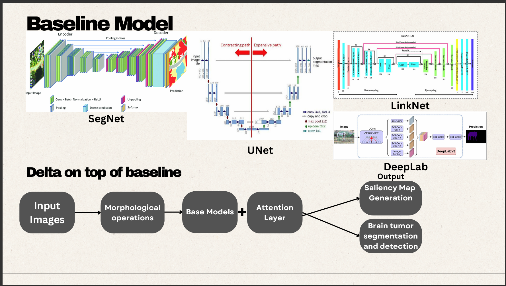
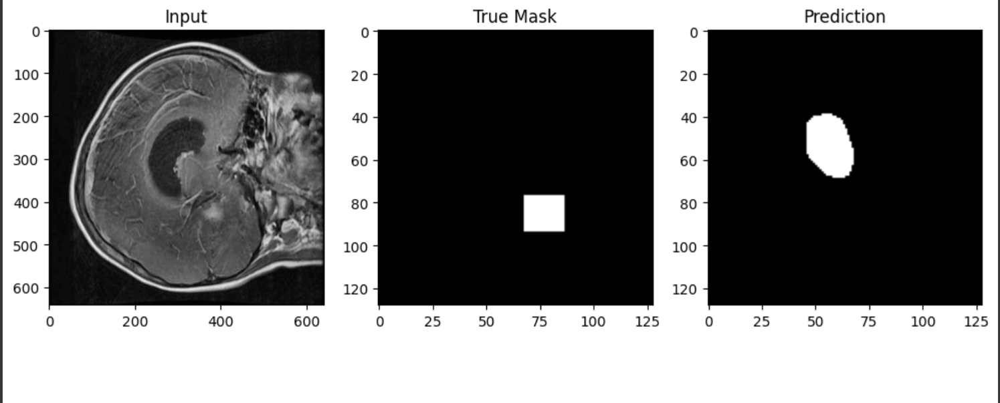
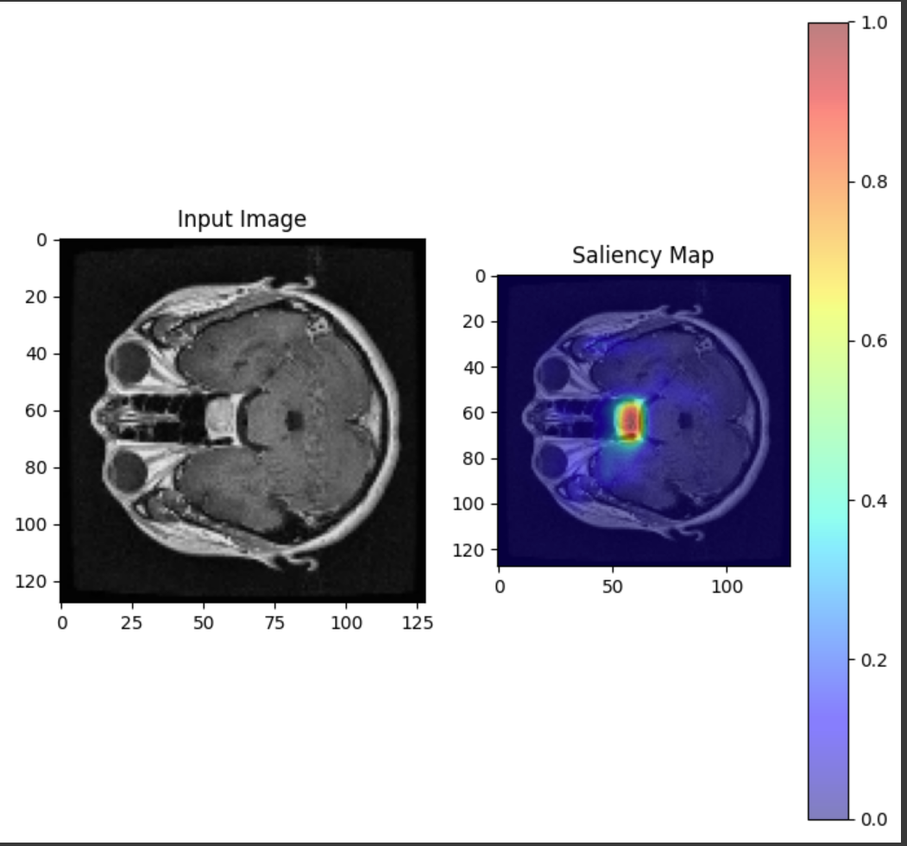
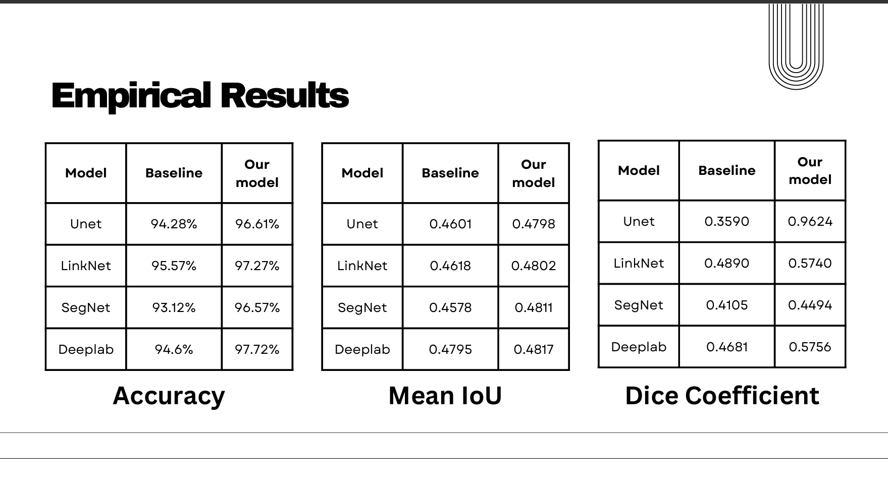

# EXPLAINABLE-AI-AND-ATTENTION-DRIVEN-MODELS-FOR-BRAIN-TUMOR-SEGMENTATION
# Project Description
This repository contains the implementation of four baseline models combined with attention layers, which are trained from scratch without using any pre-trained models. It also generates saliency maps so that clinicians understand how the prediction result was reached for better diagnosis.
## Dataset
The dataset contains around 2200 images, divided into Tumor(1) and no tumor(0). The training portion is split into 70%, validation into 20%, and testing into 10%.
Dataset link: [https://www.kaggle.com/datasets/pkdarabi/brain-tumor-image-dataset-semantic-segmentation/data](url)

## Method

Our method integrates advanced techniques, such as saliency maps, attention layers, and morphological operations, to enhance the performance of the U-Net model for brain tumor classification and segmentation. These additions improve feature localization, model interpretability, and segmentation accuracy.

+ **Saliency Maps**: Saliency maps highlight the most critical regions of the input image that influence the model’s predictions. By incorporating saliency maps into the training process, we emphasize the areas of interest, such as tumor boundaries, ensuring that the model learns features most relevant to the task.
+ **Attention Layers**: Adding attention mechanisms enhances the U-Net architecture. These layers adaptively focus on the most informative parts of the feature maps during training, reducing noise from irrelevant regions. This improves the model’s ability to capture fine details in tumor boundaries while retaining global contextual information.
+ **Morphological Operations**: Post-processing with morphological operations, such as dilation and erosion, refines the segmentation masks. These operations help to smooth edges, remove noise, and fill gaps in the predicted tumor regions, leading to cleaner and more clinically helpful segmentation results.

The attention mechanism enhances features from the encoder for the decoder using spatial attention. Skip connections and gating signals from the decoder are reduced in dimensions through 1x1 convolutions, combined, passed through ReLU, and processed using sigmoid activation to create a spatial mask. This mask refines the skip connection, improving segmentation by focusing on critical regions.

+ **Improved Localization**: Attention gates enhance relevant regions and ignore background noise, improving segmentation accuracy.
+ **Better Generalization**: Emphasizing important features helps the model generalize and avoid overfitting.

Spatial attention mechanisms assign higher importance to informative pixels, improving boundary precision in tasks like tumor segmentation. Channel attention mechanisms amplify relevant feature maps, leading to robust tumor representation.

Morphological operations refine segmentation by smoothing edges, connecting regions, filling holes, and enhancing boundary precision, improving metrics like Dice Coefficient and IoU.

### Explainable AI (XAI)
XAI enhances interpretability using saliency maps, highlighting influential areas of an input image.
### Baseline Model

### Models Trained
1. **U-Net**
   
 The U-Net model with attention gates is a sophisticated architecture for medical image segmentation tasks, such as brain tumor detection. It features an encoder (contracting path) and a decoder (expanding path). The encoder progressively down-samples the input image through convolutional layers and max-pooling, employing dropout layers to prevent overfitting. Each encoder block contains two 3x3 convolutional layers activated by ReLU. Two 3x3 convolutional layers with 1024 filters capture the most complex features at the bottleneck. In the decoder, the model up-samples feature maps using transposed convolution layers, doubling their spatial dimensions at each step. Attention gates within the decoder dynamically weight the encoder feature before concatenation, which helps highlight relevant areas and suppress irrelevant ones, thus improving segmentation accuracy. Each decoder block includes an attention gate and two 3x3 convolutional layers to refine the feature maps. The output layer is a 1x1 convolution with a sigmoid activation, generating a binary mask for precise segmentation. This attention mechanism significantly enhances the model’s ability to focus on essential structures, making it particularly useful for high-accuracy medical image analysis.

2. **LinkNet**
   
 The LinkNet model with attention gates, designed for tasks like brain tumor detection in medical images, consists of an encoder and a decoder, similar to U-Net but optimized for efficiency. The encoder includes blocks with two 3x3 convolutional layers, ReLU activation, max-pooling layers, and dropout for regularization, outputting feature maps, and skip connections. The bottleneck processes abstract features with two 3x3 convolutional layers containing 1024 filters. The decoder up-samples feature maps using transposed convolution, integrating skip connections to preserve spatial information. Attention gates enhance focus on significant regions by weighting the encoder’s features, improving segmentation accuracy. The final output layer, a 1x1 convolution with sigmoid activation, produces a binary mask for precise segmentation. This attention mechanism effectively prioritizes important features, enabling accurate segmentation of complex medical images.

3. **SegNet**
   
 The SegNet architecture with attention gates is a deep-learning model for image segmentation in medical image analysis. It features an encoder-decoder framework with attention mechanisms that enhance feature representation and focus on relevant areas. The encoder, composed of convolutional layers with ReLU activation and max-pooling, extracts features, while the bottleneck processes high-level features using two 3x3 convolutional layers with 1024 filters. In the decoder, transposed convolution layers upsample feature maps, and attention gates refine skip connections by generating attention masks to emphasize essential features. The output layer, a 1x1 convolution with sigmoid activation, creates a binary mask for precise segmentation. This model excels in providing detailed and accurate segmentations necessary for medical imaging. 

4. **Modified DeepLab**
 
 The modified DeepLab architecture for semantic image segmentation builds on the original DeepLab model with Atrous Spatial Pyramid Pooling (ASPP). The encoder utilizes 3x3 convolutions and max-pooling to extract features while maintaining spatial information through padding and ReLU activation. The ASPP layer enhances the model by applying 1x1 and 3x3 convolutions with varying dilation rates and global average pooling, capturing multi-scale context and improving boundary detection. In the decoder, features are upsampled using ‘UpSampling2D’ layers and refined with additional 3x3 convolutions. The final output layer, a 1x1 convolution with sigmoid activation, produces a binary mask for pixel-wise segmentation. This architecture is ideal for detailed segmentation and multi-scale context applications, such as medical image analysis and urban scene parsing. 

## Experiment Details

+ Segmentation and Detection Accuracy: The performance of the four architectures was evaluated based on Accuracy, Mean IoU, and Dice Coefficient. LinkNet achieved an accuracy of 97.27%, almost the same as the accuracy obtained by Modified DeepLab, which has the highest accuracy at 97.72%, while U-Net and SegNet attained 96.61% and 96.57%, respectively. For Mean IoU, Modified DeepLab led with 0.4817, followed by SegNet (0.4811), LinkNet (0.4802), and U-Net (0.4798). Regarding the Dice Coefficient, Modified DeepLab also performed best at 0.5756, with LinkNet at 0.5740, SegNet at 0.4494, and U-Net trailing at 0.3624. These results highlight modified DeepLab’s strong overall performance, particularly in segmentation quality, while LinkNet 6 demonstrated slightly higher accuracy. \\
+ Interpretability: Explainable AI, especially Saliency Maps, helped focus on tumor regions in U-Net and DeepLab, aligning closely with expert annotations.SegNet and LinkNet showed moderate interpretability, with saliency maps less consistent in localizing the smaller tumor regions.\\
+ Efficiency: The modified Deep-Lab model demonstrated the fastest inference time, making it suitable for real-time applications, though it traded off some segmentation precision.

## Results
 After all the models were trained, namely the U-Net, LinkNet, SegNet, and the modified DeepLab  model, the modified DeepLab model gave the highest and best performance with an accuracy score of 97.72%. Each model will give output in these formats
Prediction 
 
Saliency Map

Empirical Results

## Conclusion

 We obtained results from implementing and comparing four architectures, U-Net, LinkNet, SegNet, and the customized Deeplab model, demonstrating how effectively attention mechanisms and saliency maps are incorporated into brain tumor segmentation and detection. The attention layers  significantly improved the model’s ability to prioritize critical regions, enhancing segmentation accuracy. The key observation was that we could efficiently perform an efficiency comparison using the IOU score, Accuracy score, and Dice coefficient metrics, including attention mechanisms and saliency maps, to better visualize where the model is focusing

